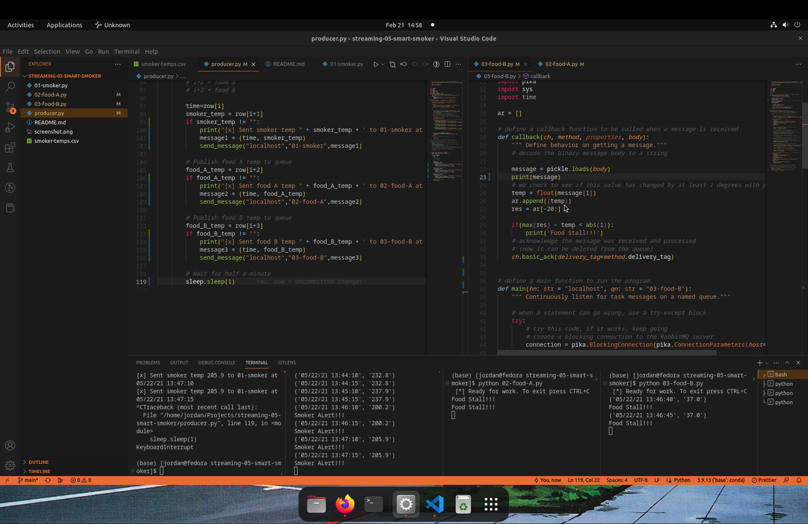

# streaming-06-smart-smoker
In this project, we have a producer sending out tuples encoded as a binary message to 3 consumers, each respectively handling the smoker temperature, food a temperature, and food b temperature. The consumer monitoring the smoker temperature will alert if the temperature goes down by 15degrees in the past 5 iterations (or 2.5 minutes). The two food consumers monitor and will alert if the temperature of food changes by more than 1 degree in 20 iterations, or 10 minutes. Author: Jordan Woodson
    Date: FEB 21, 2023
